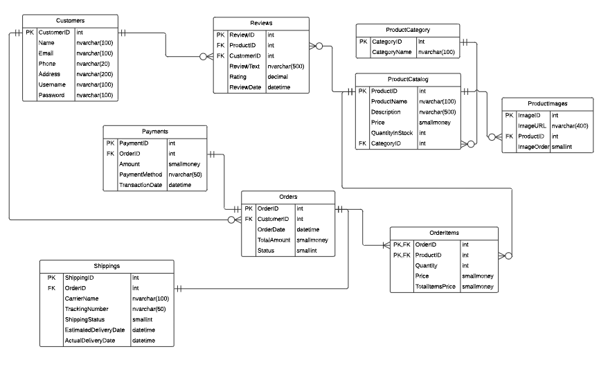

Onlinestore readme · MD
<h1 align="center">Online Store Database</h1> 
 <em>A relational database for an online store, designed and built in Microsoft SQL Server.</em> 
 
    
 
 <a href="#overview">Overview</a> &nbsp;|&nbsp; <a href="#key-features">Key Features</a> &nbsp;|&nbsp; <a href="#skills-demonstrated">Skills</a> &nbsp;|&nbsp; <a href="#entity-relationship-diagram">ER Diagram</a> &nbsp;|&nbsp; <a href="#how-to-run">How to Run</a> &nbsp;|&nbsp; <a href="#developed-by">Developed By</a> 

Overview
This project is a relational database for an online store, designed from scratch in Microsoft SQL Server. It models customers, products, orders, payments, shipping, and reviews, with the relationships between them enforced through primary and foreign keys.

The database follows a normalized design, so data such as product and customer information is stored once and referenced where needed, which keeps the data consistent and avoids duplication.

Key Features
Feature	Description
Customer Management	Store customer accounts and contact information
Product Catalog	Products organized into categories, with stock and pricing
Order Processing	Orders made up of multiple order items
Payments	Payment records linked to each order
Shipping Tracking	Shipping status and delivery dates for each order
Product Reviews	Customer ratings and reviews linked to products
Views	Pre-built views that summarize orders and products
Stored Procedure	A stored procedure for retrieving a customer's order history
Skills Demonstrated
<h3 align="center"> SQL &nbsp;|&nbsp; Database Design &nbsp;|&nbsp; Relational Modeling   Joins &nbsp;|&nbsp; Aggregate Functions &nbsp;|&nbsp; Subqueries &nbsp;|&nbsp; Views &nbsp;|&nbsp; Stored Procedures </h3>
Entity Relationship Diagram

  
 
<em>Nine tables connected through primary and foreign keys, covering customers, products, orders, payments, shipping, and reviews.</em>

Database Structure
Table	Purpose
Customers	Customer accounts and contact details
ProductCategory	Product categories
ProductCatalog	Products, their price, and stock
ProductImages	Images linked to each product
Orders	Orders placed by customers
OrderItems	The products and quantities within each order
Payments	Payment records linked to each order
Shippings	Shipping status and delivery dates for each order
Reviews	Customer ratings and reviews for products
How to Run
Download or clone this repository.
Open SQL Server Management Studio (SSMS).
Open schema.sql and execute it. This creates the OnlineStore database and all nine tables.
Open seed-data.sql and execute it. This adds sample customers, products, and orders so the queries return results.
Open queries.sql and execute it to create the views and the stored procedure, and to try the sample queries.
Developed By
<h1 align="center">Talal Altuwairiqi</h1> 
    

